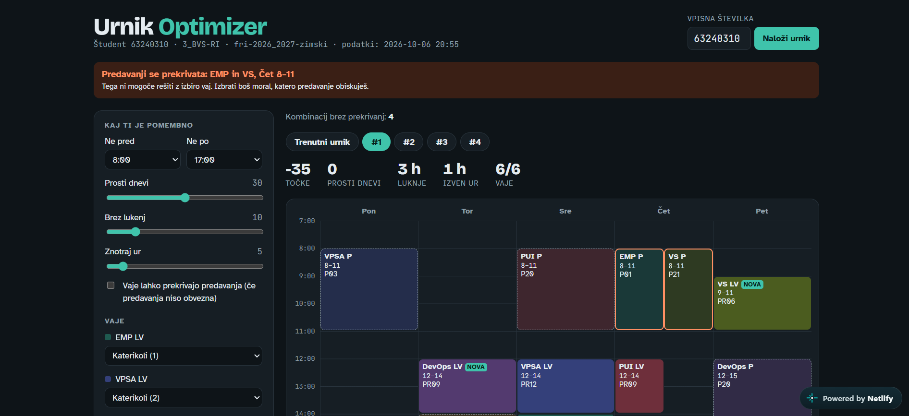
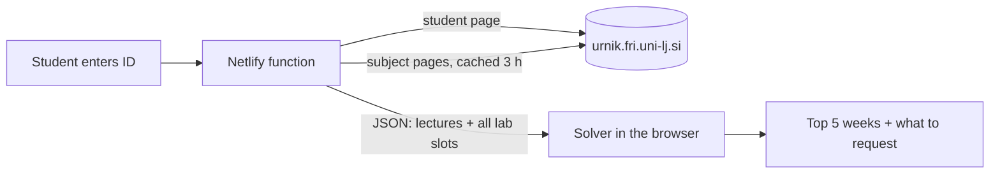

# Urnik Optimizer

[](https://github.com/iamsakan/urnik-optimizer/actions/workflows/test.yml)
[](https://urnik-optimizer.netlify.app)
[](LICENSE)

**Finds the best combination of lab groups for your FRI timetable, with no overlaps.**

Every semester, students at the Faculty of Computer and Information Science (FRI, University of Ljubljana) get a timetable where lab sessions clash with each other or with lectures, or are spread across the week with long gaps. Urnik Optimizer downloads your timetable, tries every possible combination of lab groups, and shows you the best weeks based on what you care about.

**[Try it live →](https://urnik-optimizer.netlify.app)**



## Features

- **Enter your student ID, get results.** Your timetable and every lab slot for your program are loaded automatically from [urnik.fri.uni-lj.si](https://urnik.fri.uni-lj.si).
- **Only valid schedules.** Every suggested week is guaranteed to have no overlapping labs.
- **Your priorities.** Weigh free days, gaps between classes and early or late hours, and the ranking updates instantly.
- **Lock what you already have.** Fix a lab group you already got and optimize the rest around it.
- **Clear next steps.** A list of which groups to keep, swap or join, with the exact group codes to request.
- **Honest about clashes.** Lectures that overlap each other can't be fixed by choosing labs, so they're flagged separately.
- **Shareable links.** `?student=63240310` opens a timetable directly.

## How it works



**1. Collecting the data.** A browser can't read another website's pages directly, so a small serverless function does it. It downloads the student's timetable, detects their program from group codes (e.g. `3_BVS-RI`), then downloads each subject's page and keeps only the lab slots meant for that program.

**2. Searching.** This is a constraint satisfaction problem. Lectures are fixed. Each subject's lab type (e.g. *TPO, lab work*) is a variable whose values are its time slots. A backtracking search assigns one slot per variable and abandons any branch as soon as a slot overlaps something already placed. A typical semester has a few hundred combinations at most, so the search finishes instantly in the browser.

**3. Ranking.** Each valid week gets a score from the user's weights:

```
score = free_days × w₁ − gap_hours × w₂ − hours_outside_window × w₃
```

## Tech stack

| Part | Technology |
| --- | --- |
| Frontend | Plain HTML, CSS and JavaScript (no framework, no build step) |
| Solver | JavaScript, backtracking search |
| Data fetching | Netlify Functions (Node.js) + [cheerio](https://cheerio.js.org) for HTML parsing |
| Offline tool | Python + requests + BeautifulSoup |
| Hosting & CI | Netlify, GitHub Actions |

## Project structure

```
public/
  index.html              the app
  solver.js               search + scoring
  timetable.json          example data (used by "Poglej primer urnika")
netlify/functions/
  timetable.js            downloads and parses the FRI timetable
tools/
  fetch_urnik.py          the same downloader in Python, for offline use
test.js                   solver tests: no result may contain an overlap
test-function.js          function tests against a fake FRI server
```

## Run locally

```bash
npm install
npm test
```

To try the page with the example data, serve the `public` folder:

```bash
cd public
python -m http.server 8000
```

Then open http://localhost:8000 and click **Poglej primer urnika**.

Without Node, the Python tool downloads any student's data into `timetable.json`:

```bash
pip install requests beautifulsoup4
python tools/fetch_urnik.py 63240310
```

## Deploy your own

1. Fork this repository.
2. In Netlify, choose **Add new site → Import from Git** and pick your fork.
3. That's it. `netlify.toml` tells Netlify where the site and the function are.

## Being a good guest

- Subject pages are cached for 3 hours, so many students using the app doesn't mean many requests to the faculty server.
- Student IDs are not stored or logged.
- Lab groups have capacity limits and are assigned by the faculty. This is a planning tool: it tells you which groups to ask for.

## Author

Built by [@iamsakan](https://github.com/iamsakan), a computer science student at FRI.

## License

[MIT](LICENSE)
